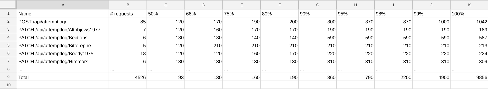
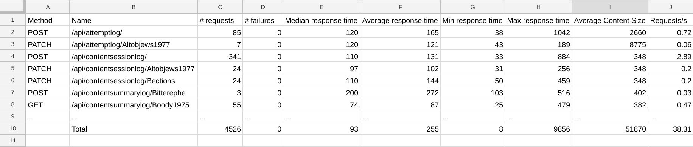

# Test results

[Velox](../README.md) ⟶ [Detailed documentation](../README.md#detailed-documentation) ⟶ Test results


## Overview

As Velox uses 3rd party library [Locust](https://locust.io/) to do the actual load testing of a runnning Kolibri server instance, it is also conveniently using its test results output.

## Results

After a successful test run, Velox will produce the results of the test in the `output/locust` directory of your Velox installation by creating two separate `.csv` files:
- distribution results
- requests results

Results are Locust generated `.csv` files, named using the following template:

```{year}_{month}_{day}__{hours}_{minutes}_{seconds}__{microseconds}_{scenario}_{csv type}.csv```

e.g. result files generated for the `my_scenario.py` file would be:

- ```2018_07_13__14_51_34__753905_my_scenario_distribution.csv```
- ```2018_07_13__14_51_34__753905_my_scenario_requests.csv```

## Distribution `.csv`

### Example



### Understanding the results

This type of test results basically reports on the requests distribution by listing the percentages of requests completed in a given time interval.

Looking at the above shown example, this would mean that 50% of the total requests were completed under 93ms and 66% of requests were completed under 130ms and so on. Of course, instead of looking at the row with the total counts, stats for the individual rows will be calculated in the same manner.

## Requests `.csv`

### Example



### Understanding the results

_Requests_ `.csv` results file is pretty much self-explanatory — it contains the stats for the following metrics:
- total number of requests sent
- number of failed requests
- median response time
- average response time
- minimum response time
- maximum response time
- average content size
- requests/s rate

When running Velox to test a certain Kolibri server's performance improvement, it is often helpful to compare the **total number of requests sent** metric combined with the **number of failed requests** as that effectively shows how many constant requests that Kolibri server can handle within the given `run_time` period.

------

## Table of Contents

- [Velox](../README.md)
  - [Installation](./installation.md)
  - [Configuration options](./configuration-options.md)
  - [Using Velox](./using-velox.md)
  - **Test results**
  - Advanced usage
    - [Virtual machines](./advanced-usage-vms.md)
    - [Kolibri profiling](./advanced-usage-profiling.md)
